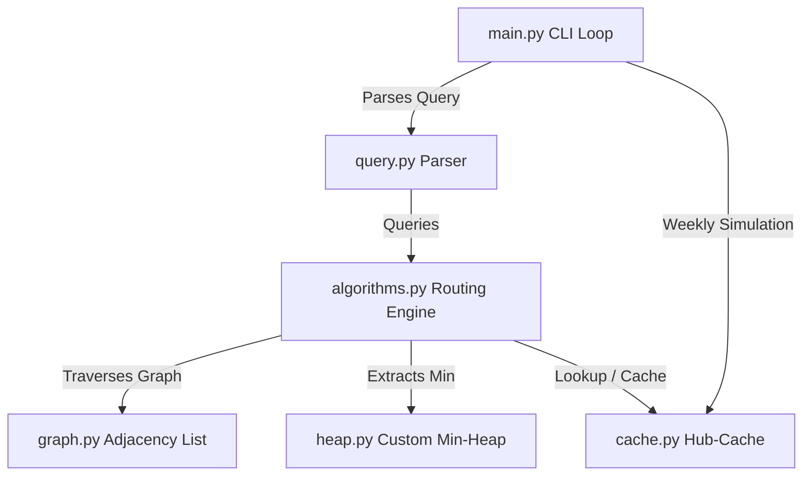

# Smart Path Finder

An interactive, high-performance pathfinding and routing engine implemented entirely from scratch. This project is dependency-free, utilizing only Python's standard library to build custom data structures (like a binary min-heap) and routing algorithms.

---

## 🌟 Key Features

* **🎛️ Interactive Routing CLI:** Command loop enabling real-time navigation queries, graph statistical reviews, and dynamic map updates.
* **⚡ Multi-Algorithm Comparisons:**
  * **Standard Dijkstra:** Single-source shortest path based on distance weights.
  * **Bidirectional Dijkstra:** Searches outwards from both source and target to reduce the search space and accelerate query speeds.
  * **Time-Aware Dijkstra:** Accounts for dynamic hourly traffic patterns. Chooses the fastest route based on a departure hour (0-23) utilizing sinusoidal rush-hour traffic multipliers.
* **🚧 Dynamic Obstacle Avoidance:** Exclude nodes (`avoid_nodes`) or specific road segments (`avoid_edges`) on-the-fly without rebuilding the graph.
* **🚀 Hub-Based Precomputation Cache:** Precomputes path distances between high-degree structural "hub" nodes, caching results to bypass redundant queries.
* **📊 Benchmarking Suite:** Empirical evaluation tool (`evaluation.py`) that compares execution time, node exploration count, and cache hit metrics.

---

## 🏗️ Technical Architecture



* **`heap.py`:** A custom binary Min-Heap supporting $O(\log V)$ decrease-key operations—critical for optimal Dijkstra implementations.
* **`graph.py`:** Handles grid generation (supporting diagonal edges and high-speed highway weights) and JSON serialization.
* **`cache.py`:** Precomputes routes for critical hub nodes, scaling automatically with map size.

---

## ⚙️ Getting Started

### Prerequisites
* **Python:** v3.10 or higher.
* No external libraries are needed.

### Running the Application

1. **Start the Interactive Interface:**
   ```bash
   python main.py
   ```
   * On startup, you can choose to **Generate a new grid graph** (specifying dimensions, e.g., `70x70`) or **Load an existing graph** from a JSON file (like `graph.json`).

2. **Run Performance Benchmarks:**
   ```bash
   python evaluation.py
   ```

---

## 📝 Query Syntax & Usage

Queries are entered in the interactive prompt using the following syntax:

```bash
query <source> <destination> [avoid_nodes n1,n2,...] [avoid_edges u1-v1,u2-v2,...] [departure <hour>]
```

### Examples
* **Basic Shortest Path:**
  ```text
  query 0_0 69_69
  ```
* **Traffic-Aware Query at 8:00 AM:**
  ```text
  query 0_0 30_30 departure 8
  ```
* **Pathfinding avoiding blocked nodes:**
  ```text
  query 10_10 50_50 avoid_nodes 30_30,35_35
  ```
* **Pathfinding avoiding dynamic road closures at 5:00 PM:**
  ```text
  query 10_10 50_50 avoid_edges 20_20-21_20,30_30-31_30 departure 17
  ```

---

## 🖥️ Command List

* `map_info` — View node naming rules and active map scale.
* `stats` — Review cache hit ratios and search stats.
* `sample_nodes` — Display valid nodes to run test queries.
* `check_node <node_id>` — Detail a node's coordinates and neighbors.
* `update` — Simulate weekly traffic updates (invalidates current cache).
* `save <file_name>` — Export the active graph layout to a JSON file.
* `quit` — Exit the program.
